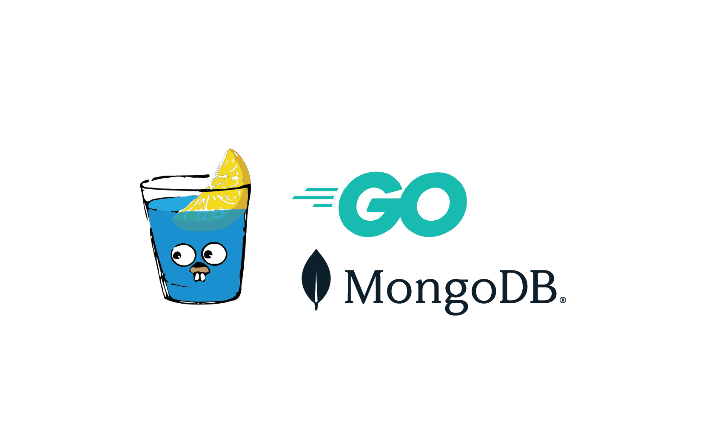

# Auth Service — Go, Gin, MongoDB, JWT



A small JWT-based authentication service built with Gin and MongoDB. It provides:

- **Signup** (`POST /signup`) — create account
- **Login** (`POST /login`) — returns `access_token` and `refresh_token`
- **Refresh** (`POST /refresh`) — exchange `refresh_token` for a new `access_token`
- **Logout** (`POST /logout`) — revoke stored refresh token(s) for the user
- **Me** (`GET /me`) — protected route that returns the authenticated user id and role
- **Admin** (`GET /admin/users`) — role-protected route (ADMIN only)

## Prerequisites

- Go 1.20+
- MongoDB running locally or accessible via `MONGODB_URI`

## Environment

Create a `.env` in the project root:

```env
PORT=8000
MONGODB_URI=mongodb://localhost:27017
SECRET_KEY=your_super_secret_key_here